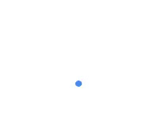
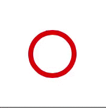

#About
TXMaterial is a Swift Cocoa framework that implements some of Google's [Material Design](http://www.google.com/design/spec/material-design/introduction.html) features for Mac and iOS.

I'm really intrigued by Material Design - Google's UI and UX guidelines for mobile (primarily Android), web and desktop (primarily Chrome OS). Although I don't think developers should blindly port across a UI from one platform to another, I do think there are features here that deserve a second look from iOS developers.

I hope to implement as many Material Design features as I have time for, and as I feel are appropriate to be ported to iOS. I have started with the [circular progress indicator](http://www.google.com/design/spec/components/progress-activity.html#)

##ActivityProgressView
Activity progress view is an implementation of the Material Design  [circular progress indicator](http://www.google.com/design/spec/components/progress-activity.html#). It performs the same duty as UIActivityIndicator in that it indicates an on-going activity, but it also combines some of the functionality of UIProgressView, in that it is able to visually indicate the progress of a task.

UIActivityIndicator is pretty long in the tooth, and it overdue a fresh new look. I think the Material Design circular activity indicator is a nice alternative. It is able to show both indeterminate activity, and task progress, and does so in an interesting dynamic fashion. 

(note these gifs give a poor impression of the fluidity of the movement)

##Future development
Next up is the linear activity indicator and progress view !